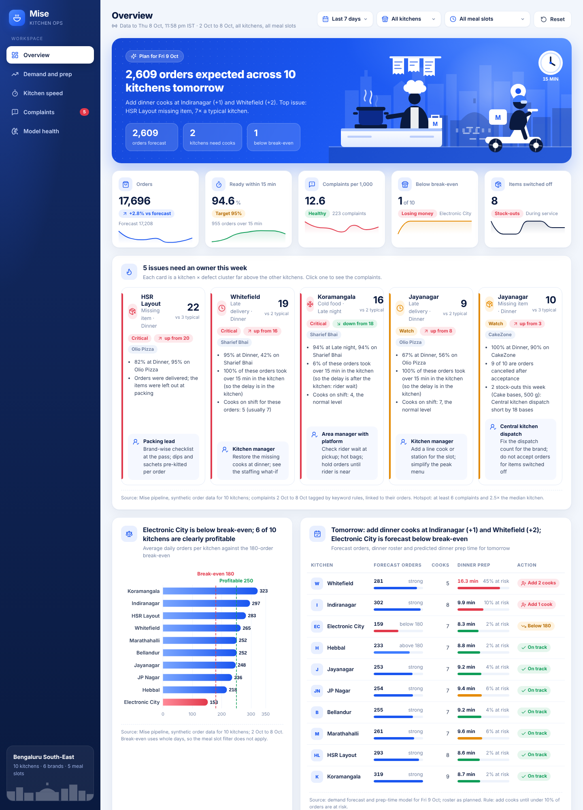
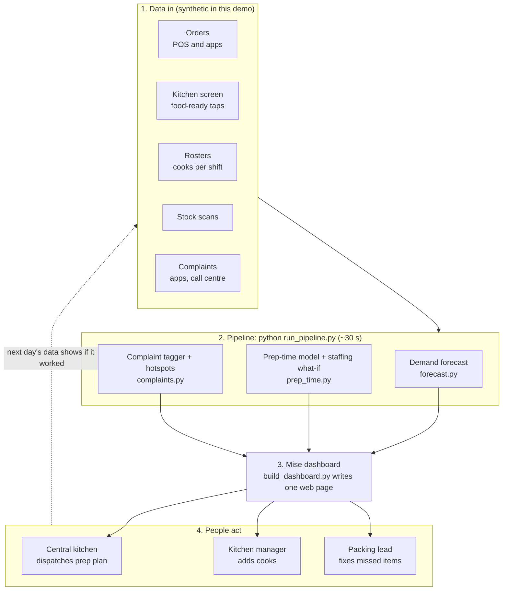
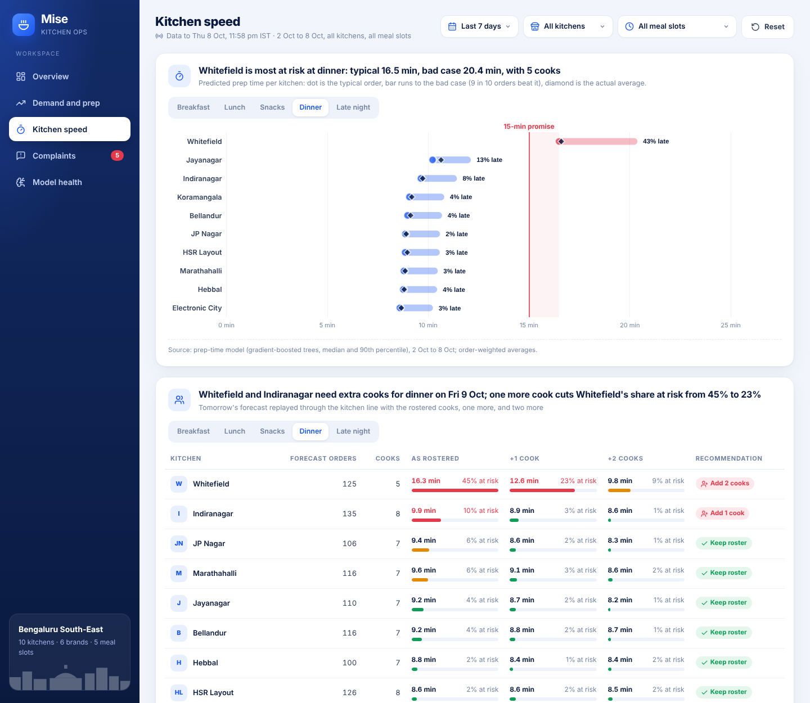
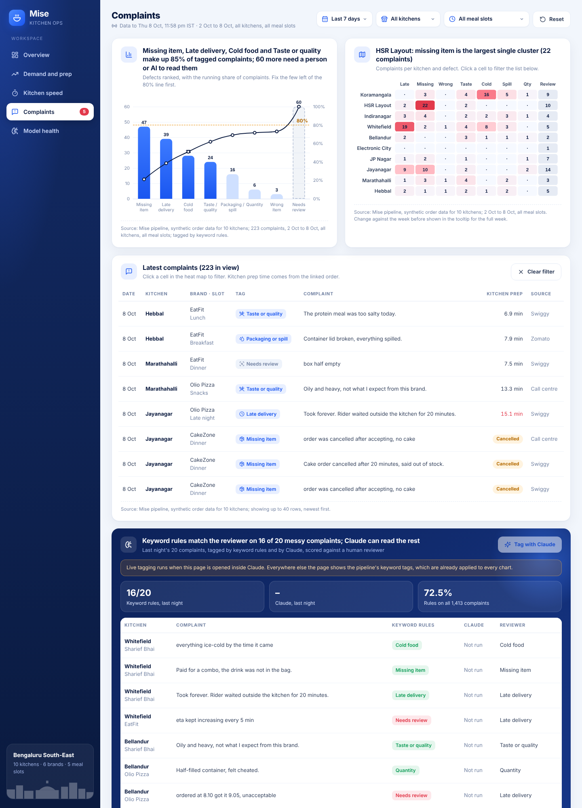
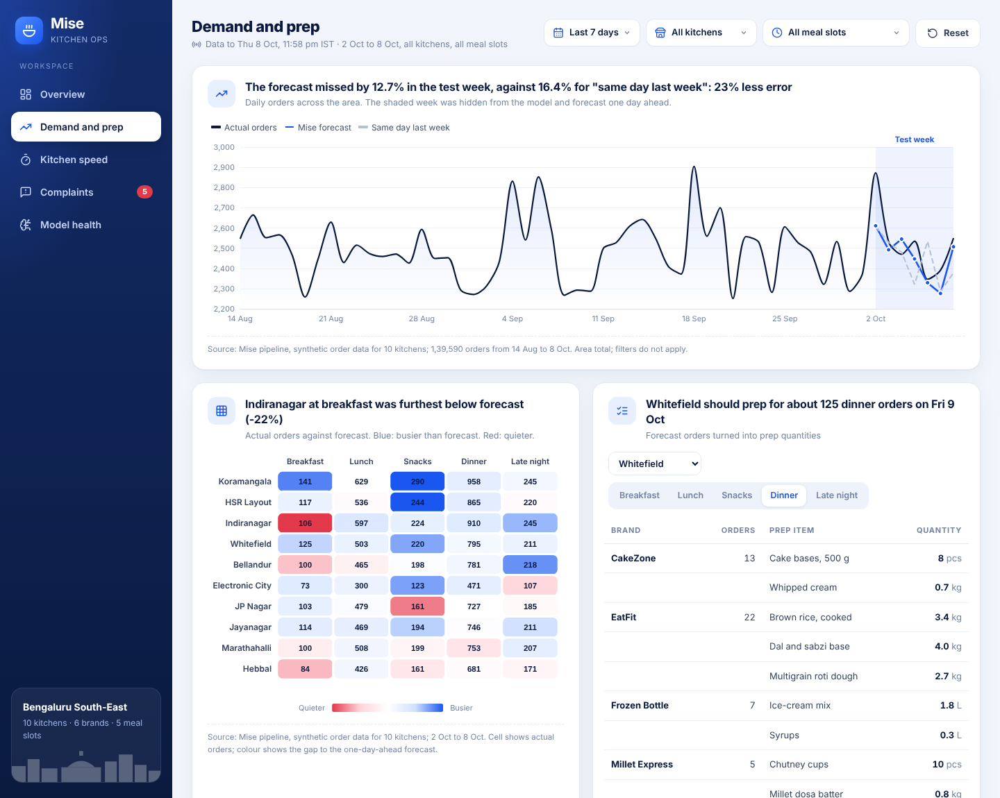
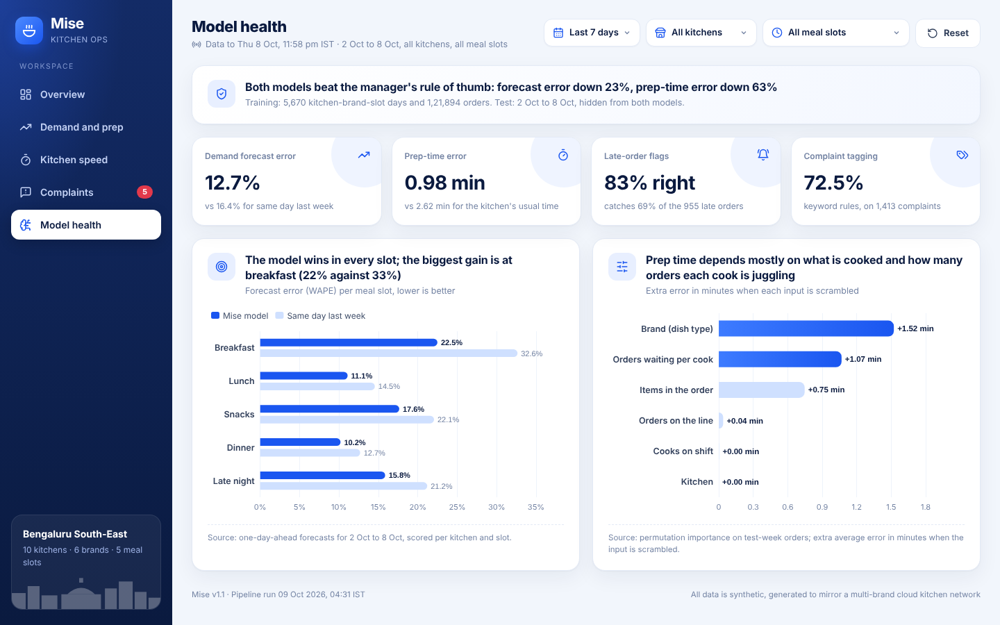

# Mise: kitchen operations control tower

**Mise** helps an area operations manager run 10 multi-brand cloud kitchens: what to prep, whether tonight's roster can hold the rush, and which complaint causes to fix first.

**Live dashboard:** https://tootomar.github.io/mise-kitchen-ops/



> All data is synthetic. Business assumptions (180 orders a day break-even, a 15-minute food-ready promise, a 1.6–1.7% complaint rate, multi-brand kitchens on one line) come from public interviews with a cloud-kitchen founder. No company data is used.

## The problem

A cloud-kitchen area manager looks after about 10 kitchens, each cooking for 4–6 brands on one line. Three questions decide their day:

1. **How much should each kitchen prep for each meal slot tomorrow?** Over-prep is waste; under-prep is items switched off on Swiggy and Zomato.
2. **Can tonight's roster hold the dinner rush?** Late food is about half of all customer complaints.
3. **What keeps going wrong, and where?** Complaints arrive as free text, often in Hinglish, and are hard to count.

Today these are answered from separate partner dashboards, spreadsheets and phone calls. Mise answers them on one screen.

## What it does

| Tab | Question it answers | How |
| --- | --- | --- |
| Overview | What needs action today? | Complaint hotspots with evidence, an owner and a first action; kitchens against break-even; tomorrow's outlook |
| Demand and prep | How much to prep? | Demand forecast per kitchen, brand and meal slot, turned into a prep list in kg and pieces |
| Kitchen speed | Will we be late tonight? | Predicted prep time per kitchen; staffing what-if with the rostered cooks, +1 and +2 |
| Complaints | What keeps going wrong? | Tagged complaints, Pareto chart, kitchen × defect heat map, live re-tagging with Claude |
| Model health | Can I trust the numbers? | Each model tested on a held-out week against the rule a manager would use |

## Results on the held-out week (2–8 Oct 2026)

| Check | Mise | Simple rule |
| --- | --- | --- |
| Demand forecast error (WAPE) | **12.7%** | 16.4% ("same day last week") |
| Prep-time error (mean absolute) | **0.98 min** | 2.62 min ("usual time for this kitchen and slot") |
| Late-order flags | 83% correct, catch 69% of late orders | none |
| Complaint tagging, keyword rules | 72.5% match with reviewer labels | Claude tags the messy rest live |
| Planted operational problems found | **5 of 5** | |

The five problems hidden in the data, and found without being told where they were: Whitefield lost two dinner cooks; HSR Layout's packer misses pizza dips; Electronic City demand dropped below break-even; Koramangala's late-night biryani waits for riders and arrives cold; Jayanagar ran out of cakes.

## How it works



| Step | File | What it does |
| --- | --- | --- |
| 1 | `src/mise/generate_data.py` | Simulates 8 weeks of orders (~1.4 lakh) for 10 kitchens. Each kitchen is a queue: orders wait for a free cook, so prep time rises when the line is busy. Plants five problems. |
| 2 | `src/mise/forecast.py` | Gradient-boosted trees (scikit-learn) forecast orders per kitchen × brand × slot one day ahead, from lags, rolling averages, weekday, rain and holidays. Backtested on the last week. Forecast × recipe = prep plan. |
| 3 | `src/mise/prep_time.py` | Quantile gradient-boosted trees predict typical (p50) and bad-case (p90) prep time per order from brand, items, orders waiting per cook and cooks on shift. Tomorrow's forecast is replayed through the queue with 0, +1 and +2 cooks. |
| 4 | `src/mise/complaints.py` | Tags complaints with Claude (if `ANTHROPIC_API_KEY` is set) or keyword rules; links each complaint to its order; finds kitchen × defect hotspots and attaches evidence, owner and first action. |
| 5 | `src/mise/build_dashboard.py` | Packs results into `outputs/dashboard_data.json` and writes `dashboard/index.html`. |

A plain-English walkthrough with diagrams is in [docs/how-it-works.md](docs/how-it-works.md). Requirements from an operations manager's point of view are in [docs/requirements.md](docs/requirements.md).

## Run it yourself

You need Python 3.10 or newer.

```bash
pip install -r requirements.txt
python run_pipeline.py
```

Then open `dashboard/index.html` in any browser. To tag complaints with Claude inside the pipeline, set an API key first (optional):

```bash
pip install anthropic
export ANTHROPIC_API_KEY=your-key
python run_pipeline.py
```

## Where AI is used

| Job | Method | Why this method |
| --- | --- | --- |
| Forecast demand | Machine learning: gradient-boosted regression trees, Poisson loss | Order counts are small whole numbers; trees handle weekday × slot × brand effects without manual rules |
| Predict prep time | Machine learning: quantile gradient boosting (p50 and p90) | Managers staff for the bad case, not the average |
| Read complaints | Generative AI: Claude classifies free text, including Hinglish, into defect types with a likely cause | Keyword rules miss about a quarter of real-world complaint text |

## Repository layout

```
run_pipeline.py          one command runs everything
src/mise/                pipeline code (config, data, forecast, prep time, complaints, dashboard build)
data/                    generated orders, complaints, stock-outs, calendar, tomorrow's roster
outputs/                 model results: backtests, forecasts, prep plan, what-if, hotspots, dashboard data
dashboard/               template.html and the built index.html
docs/                    requirements, how it works, data dictionary, screenshots
```

## Screenshots

| Kitchen speed | Complaints |
| --- | --- |
|  |  |
| **Demand and prep** | **Model health** |
|  |  |

## Credits

Built by **Harsh Tomar** (MBA, IIM Bodh Gaya; Lean Six Sigma Black Belt). I chose the problem, set the requirements from an operations manager's point of view and directed the build; **Claude** (Anthropic) wrote the code. I am not a software developer, and I say so openly.

Licence: MIT.

## Publishing

`.github/workflows/pages.yml` publishes the dashboard to GitHub Pages on every push to `main`. In the repo, open Settings → Pages and set Source to **GitHub Actions** once.

The dashboard uses Plus Jakarta Sans and Sora (Google Fonts), Apache ECharts for charts and Lucide for icons, all loaded from public CDNs.
