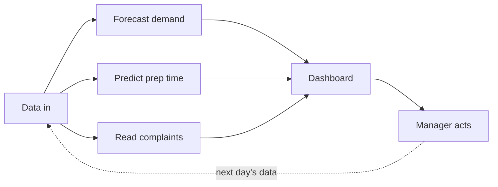
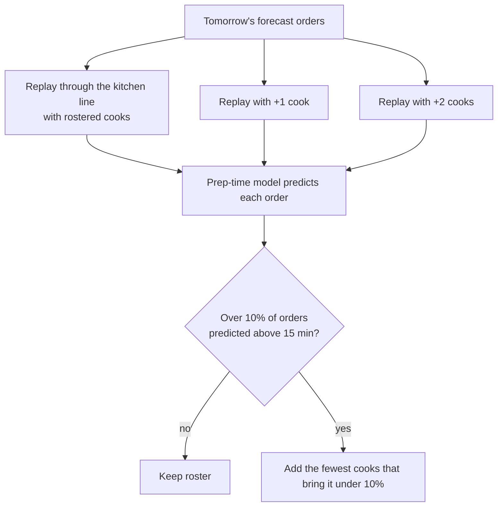
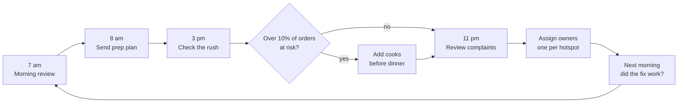

# How Mise works, in plain words

This page explains Mise for someone who does not code. You do not need to read any Python to follow it.

## The big picture

Mise does four things, in order:

1. **Collects data** about orders, kitchen timings, rosters, stock and complaints. In this demo a program invents the data, because real order data is confidential.
2. **Runs three analyses** on it: a demand forecast, a prep-time prediction and a complaint reader.
3. **Builds one web page** (the dashboard) from the results.
4. **People act** on what the page shows, and the next day's data shows whether it worked.

## Step 1: making realistic data

The program creates 8 weeks of orders for 10 Bengaluru kitchens, 6 brands and 5 meal slots: about 1.4 lakh orders.

It does not just pick random numbers. Each kitchen is simulated like a real line, the way a bank queue works: orders arrive through the evening, each waits for a free cook, and when too many orders arrive at once the wait grows. That is why prep time in the data goes up when a kitchen is short of cooks, exactly as in a real kitchen.

Five problems are hidden in the data on purpose, so we can test whether Mise finds them:

| Problem planted | Where | What Mise should notice |
| --- | --- | --- |
| Two dinner cooks resigned (from 28 Sep) | Whitefield | Slow dinners, late-delivery complaints |
| New packer misses pizza dips (from 24 Sep) | HSR Layout | Missing-item complaints on Olio Pizza |
| A competitor opened nearby (from 20 Sep) | Electronic City | Orders fall below the 180 break-even |
| Riders arrive late for late-night orders | Koramangala | Cold-food complaints, but the kitchen was fast |
| Central kitchen short-shipped cake bases (6 and 8 Oct) | Jayanagar | Cake orders cancelled, missing-item complaints |

Mise found all five.

## Step 2: forecasting demand

**Question:** how many orders will each kitchen get tomorrow, for each brand and meal slot?

For every past day, the program writes down what a manager would have known the evening before: orders on the same day last week, the average of the last 7 days, the average of the same weekday over 4 weeks, whether it rained, whether it was a holiday.

A **gradient-boosted tree model** learns how those clues relate to the next day's orders. Picture a long list of simple yes/no rules ("Friday dinner? add 25%", "raining? add 12% to delivery slots"), where each new rule fixes the mistakes the earlier rules made. Hundreds of them together make an accurate forecast.

**How we know it works:** we hide the last week from the model, ask it to forecast each of those days, and compare with what actually happened. We also compare with the rule a manager would use without Mise, "same as last week". Mise's error was 12.7% against 16.4%: about a quarter less.

The forecast then becomes a **prep list**: forecast orders × the recipe quantity per order (for example 0.14 kg of biryani masala base per Sharief Bhai order).

## Step 3: predicting prep time and testing the roster

**Question:** will tonight's orders be ready within the 15 minutes promised to Swiggy and Zomato?

Every past order tells us how long it took, and what the kitchen looked like at that moment: which brand, how many items, how many orders were already waiting, how many cooks were on shift. A second model learns that relationship.

It gives two answers per order: a **typical time** and a **bad-case time** (the time 9 out of 10 orders beat). Managers staff for the bad case.

**The staffing what-if:** the program takes tomorrow's forecast orders and replays them through the simulated kitchen line 12 times, first with the cooks on the roster, then with one more, then with two more. For each version it predicts prep times and counts the orders at risk of crossing 15 minutes. If more than 10% are at risk, Mise recommends adding cooks.

**How we know it works:** on the hidden week, the model was off by about 1 minute on average, against 2.6 minutes for "this kitchen's usual time".

## Step 4: reading complaints

**Question:** what keeps going wrong, and where?

Complaints arrive as free text. Some are tidy ("Garlic dip was missing from my order"), many are not ("dip nahi tha phir se", "eta kept increasing every 5 min").

1. **Tagging.** Each complaint gets one defect type: late delivery, missing item, wrong item, taste or quality, cold food, packaging or spill, quantity.
   - **Keyword rules** look for words like "missing" or "cold". They are free and always available, but they miss Hinglish and vague text; those go to "Needs review". They matched a human reviewer 72.5% of the time.
   - **Claude** (a large language model) reads each complaint like a person would, including Hinglish, and also suggests a likely cause. In the dashboard, "Re-tag with Claude" runs this live on last night's complaints and scores it against the reviewer.
2. **Linking.** Each complaint is joined to its order. That lets Mise separate a kitchen delay (the food took over 15 minutes to prepare) from a rider delay (the kitchen was fast but the food still arrived cold).
3. **Hotspots.** A kitchen × defect cell is a hotspot when it has at least 6 complaints in the week and is 2.5 times the median kitchen. Each hotspot gets evidence, an owner and a first action, for example: *Whitefield, late delivery: 95% at dinner, every one of these orders was slow in the kitchen, 5 cooks instead of 7, so the kitchen manager restores the missing cooks.*
4. **Pareto.** Defect types are ranked so the few that cause 80% of complaints are fixed first: the Six Sigma "vital few".

## Step 5: the dashboard

All results are packed into one data file and written into a single web page. No server or database is needed. The page has five tabs, and every chart title states the finding ("Whitefield needs two more cooks at dinner") with a source line underneath.

## The manager's day with Mise

## Words used on this page

| Term | Meaning |
| --- | --- |
| Synthetic data | Data made up by a program to behave like the real thing |
| Held-out week, backtest | Hiding the last week from the model, forecasting it, then checking against what happened |
| Gradient-boosted trees | A model built from many small yes/no rules, each correcting the errors of the ones before |
| p50, p90 | The typical time, and the time 90% of orders beat |
| WAPE | Total forecast error as a share of total orders |
| MAE | Average size of the error, in minutes |
| Permutation importance | Scramble one input and see how much worse the model gets |
| Pareto, 80/20 | A few causes make most of the problems; fix those first |
